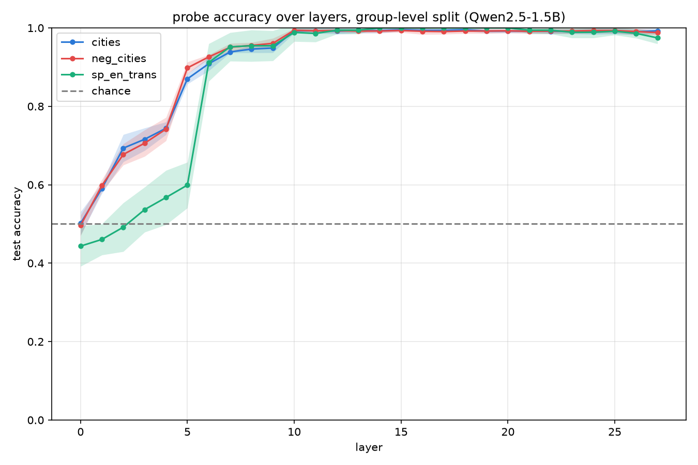
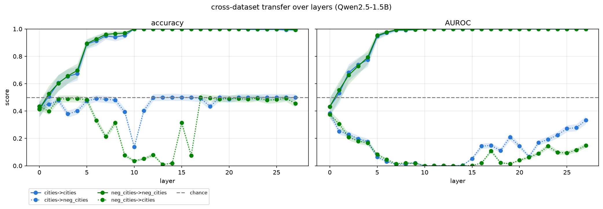
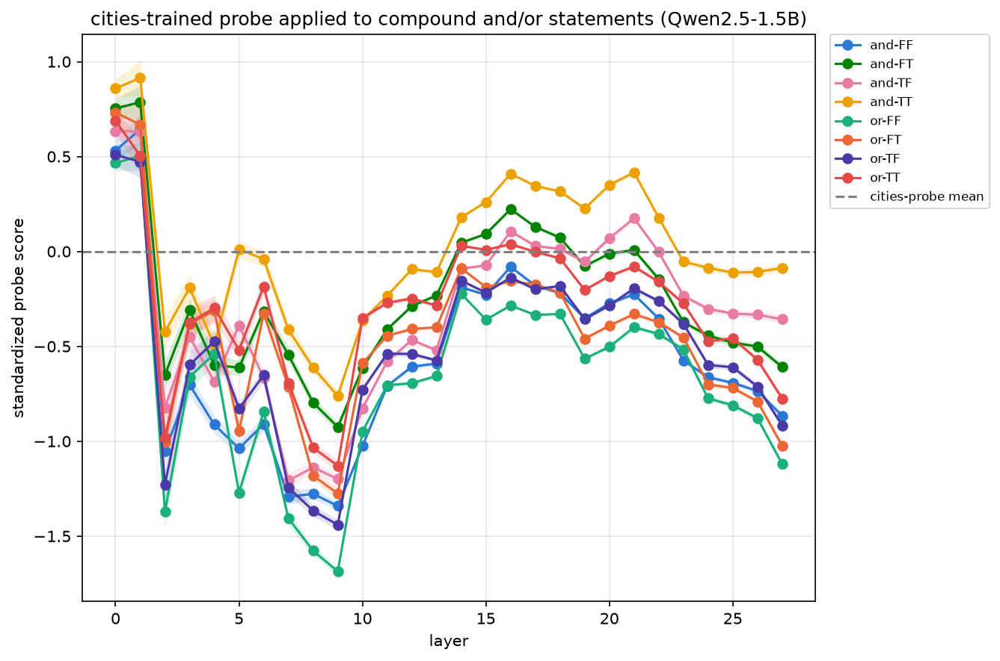
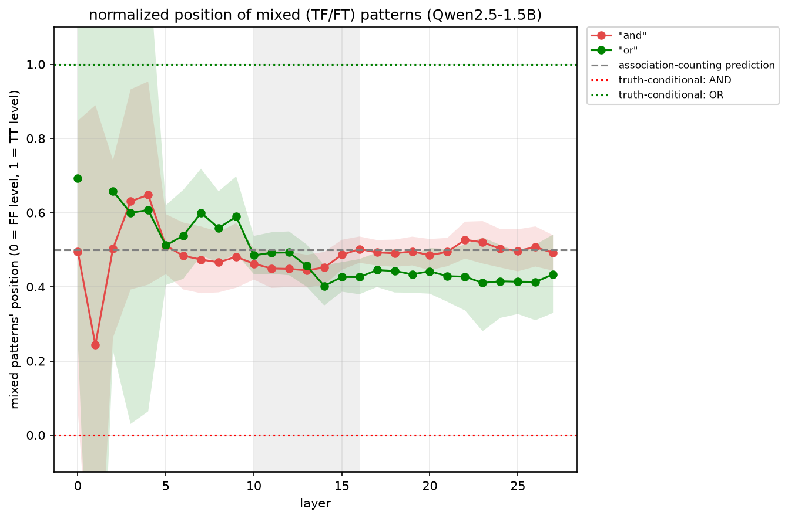
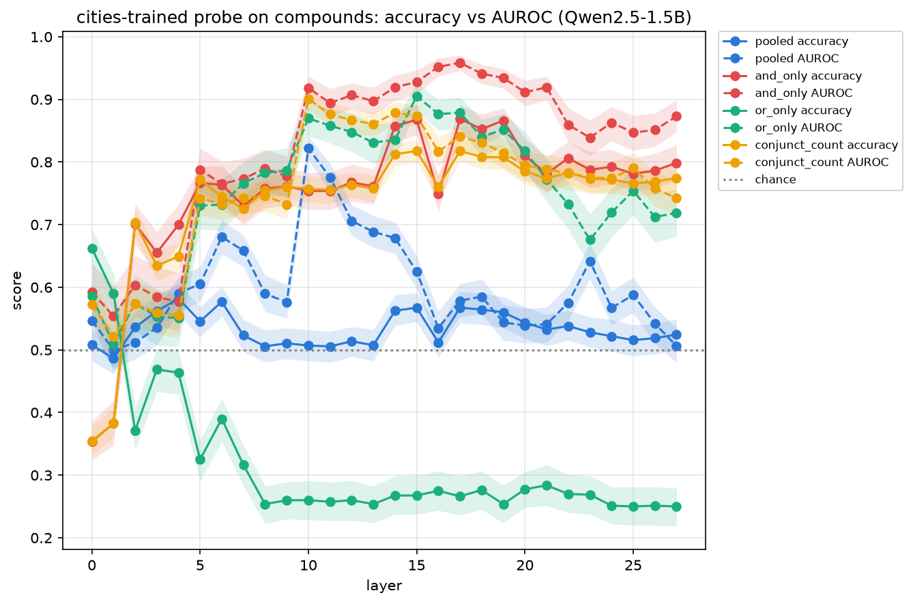
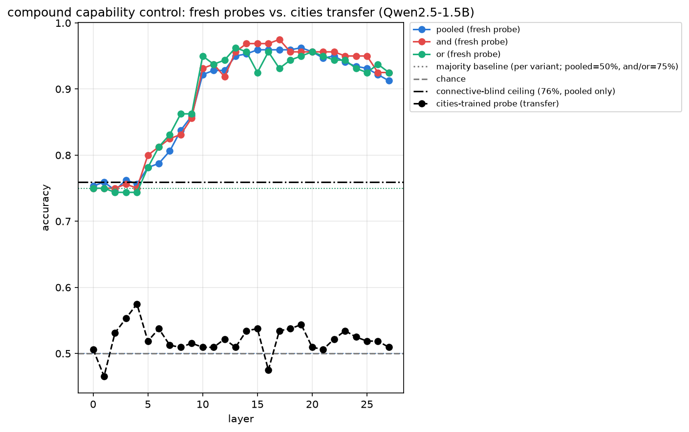

# A truth probe that doesn't track truth: what linear probes actually encode at 1.5B

*Grace Shan · BlueDot Impact Technical AI Safety, 30 hour Project Sprint · [code and results](https://github.com/graceshan/truth-probing)*

## TL;DR

- A linear probe is a classifier trained on a language model's internal activations. If it can separate out when the language model is reading true statements versus false ones, the hope is that truth is encoded in the model and we can read it directly instead of trusting what the model says. Linear probes have been proposed as safety monitors for situations like catching a model that is about to behave deceptively.
- However, what a probe learns is limited to its training data. For example, in affirmative datasets (simple statements without negation / compound logic, e.g. "The city of Tokyo is in Japan"), truth coincides with a correct city-country pairing. Therefore, a probe scoring 100% may have actually learned truth, or it may have learned a shortcut correlated with truth in the training data, such as "do the things in the sentence go together" — what I'll call factual association.
- I trained a probe on Qwen2.5-1.5B's activations on an affirmative dataset on city/country facts and achieved near-perfect results by testing on other affirmative city/country facts. However, I also tested the same probe on negations (e.g. "The city of Tokyo is not in Italy") and found it systematically ranks true statements below false ones, achieving an accuracy far below chance in the middle layers (reproducing Marks and Tegmark, 2023). It seems the probe learned to output true for a correct city/country pair; therefore, by adding a negation, the probe produces exactly the opposite answer.
- I tested the same probe on compound statements (two statements joined by AND or OR) and found that the probe not only inverts negations, but also ignores the connective (AND or OR) entirely. It seems to report roughly the average of the factual association of each of the two halves.
- However, standard metrics don't reveal these findings. At one layer, accuracy is 0.500, which looks like a probe with no signal, when in reality it sorts true statements below false ones almost perfectly. Another example is how a probe trained directly on compound statements scores 96%, which looks like it successfully handles compositional logic, when on closer inspection the probe is getting there without representing what AND and OR mean.
- The main takeaway is about validation practice; a probe that scores perfectly on the data we happen to have is not a truth detector and the gap is invisible unless you deliberately test for it.

## Motivation

Linear probes on model activations are increasingly proposed as safety tools. The idea is that instead of trusting what the model says, we can read what the model represents internally. [MacDiarmid et al. (2024)](https://www.anthropic.com/research/probes-catch-sleeper-agents) showed that a simple difference in means built from generic yes/no prompts could predict when a backdoored model would defect with AUROC above 99%.

Using probes to ensure safety rests on an implicit assumption: that the direction recovered from training data corresponds to some general notion of truth or honesty and not just a feature that correlates with truth in the data. The two can come apart. "The city of Tokyo is not in Italy" is a true sentence that contains an incorrect city-country pairing. In a dataset of affirmative statements, no example ever separates the two, so a probe trained there has no way to distinguish them and its accuracy score won't tell you which one it found.

[Marks and Tegmark (2023)](https://arxiv.org/abs/2310.06824), hereafter GoT, found that probes trained on affirmative statements often fail on negated ones, and that the failure is worse in smaller models. [Bao et al. (2025)](https://arxiv.org/abs/2506.00823) confirmed this across model families and extended it to conjunctions and disjunctions. This project asks: what is the probe tracking instead, and do our metrics detect the difference?

## The two tests

Consider a dataset with affirmative statements like "The city of Tokyo is in Japan," where statements are labelled true when the city really is in that country and false otherwise. While truth does separate out those two groups, so does something simpler: whether the city/country pair is valid. I'll call the property that gets confused with truth *factual association*, meaning whether the things in the sentence go together.

When a probe is trained on an affirmative dataset like this one, it can score near perfect without actually thinking about truth but taking a shortcut and just asserting if the sentence fulfills factual association. To find out what the probe actually learned, you need sentences where truth and factual association come apart. There are two cheap ways to build this:

**Negation.** "The city of Tokyo is not in Italy" is true but Tokyo and Italy don't go together. A probe tracking truth should score it high while a probe tracking factual association should score it low, and should be wrong on every negated statement in the same direction.

**Logical connectives.** "A is in B and C is in D" and "A is in B or C is in D" contain identical facts but have opposite truth values when exactly one half is true. A probe tracking truth should score them on opposite ends while a probe reading factual association sees the same two facts either way and can't tell them apart.

## Setup

- **Model:** Qwen2.5-1.5B (base). 28 layers, d_model=1536, loaded in float16 via [TransformerLens](https://github.com/TransformerLensOrg/TransformerLens).
- **Activations:** Residual stream after each of the 28 layers taken at the final token of each statement, following GoT.
- **Linear probes:** Logistic regression (scikit-learn, `max_iter=2000`, `C=0.1`) per layer. The regularization is necessary since d_model > training data. Splits are group-level on the city identifier so no entity crosses train/test, within-dataset results are 5 seeds with 95% intervals, transfer results are bootstrap over the evaluation data because the source probe is fit once on all of the cities dataset.
  - A linear probe is trained on the model's internal activations to predict a label. If it succeeds, the property is represented as a direction in activation space.
- **Datasets:** Three from the [geometry-of-truth repository](https://github.com/saprmarks/geometry-of-truth) and one generated for this project.
- **Repo for this project:** [graceshan/truth-probing](https://github.com/graceshan/truth-probing)

| Name | Description | # rows |
|---|---|---|
| *cities* | "The city of [city] is in [country]." | 1496 |
| *neg_cities* | Negations of statements from *cities* statements with "not." For example, The city of Los Angeles is not in the United States. | 1496 |
| *sp_en_trans* | "The Spanish word '[word]' means '[English word]'." | 354 |
| *compound_cities* | Two *cities* statements joined by "and" or "or" | 1600 |

The *compound_cities* dataset is balanced across four conjunct patterns (TT/TF/FT/FF) and two connectives (meaning there are 200 statements per permutation), with same-city compounds rejected.

Compositional truth can only be represented for facts the model knows, so I verified this first by comparing the model's log-probability for each true *cities* statement against its matched false one, the true statement scores higher for 747 of 748 cities.

**Metrics:** I use two main metrics in this project. Accuracy is the fraction of statements the probe labels correctly, which depends on where its decision threshold sits. AUROC ignores the threshold entirely and asks only whether the probe ranks true statements above false ones (1.0 is perfect, 0.5 is random, and 0.0 is perfectly backwards). The two can disagree, and in this project I aim to find what lives in that disagreement.

## Reproduction

Before I can show where the probe fails, I need to show it works. This section reproduces the GoT result on three datasets (*cities*, *neg_cities*, and *sp_en_trans*). Instead of reporting a single accuracy, I train a separate probe at each of the model's 28 layers and report an accuracy for each.

Inspired by GoT, the process was:

1. Choose one dataset (e.g. *cities*) and run it through the model, storing the activations.
2. Divide the dataset for train/test.
3. Using the training data, train logistic regressions (one per layer) on identifying truth.
4. Using the testing data and trained logistic regressions, report an accuracy per layer.

Across all three datasets, the pattern is consistent; accuracy is near chance at layer 0, rises steeply through layers 2–9, and saturates near 1.0 from layer 10 onward (Figure 1).

***Figure 1.** Probe accuracy by layer for* cities*,* neg_cities*, and* sp_en_trans*, group-level split, mean with 95% interval across 5 seeds. All three saturate near 1.0 from layer 10 onward.*

This result establishes the pipeline works, the result replicates, and the accuracy number is exactly as good as the literature reports.

## Negation and layer selection: what in-distribution accuracy can't tell you

Negated statements keep the topic and vocabulary identical and flip only the logical structure, so a probe that tracks truth should handle them and a probe that tracks factual association should get them backwards. Training on one dataset and testing on another is called transfer, and it measures whether what the probe learned holds up outside the exact data it was trained on.

I aim to separate failure to generalize logical structure (testing *cities* → *neg_cities*) from failure to generalize topic (testing *cities* → *sp_en_trans*). In the former case, topic and vocabulary are held constant while inverting the logical structure and the reverse is true for the latter.

**Negation results:** Both directions of *cities* ↔ *neg_cities* transfer are near chance at layers 0–5, then fall steeply (reaching levels near 0) around layers 10–14 before rising to near chance from layer 18 onward. In contrast, within-dataset accuracy reaches near 1.0 by layer 10 and stays there throughout.

This reproduces Marks and Tegmark (2023) at smaller scale; the layer-by-layer view adds that the failure is concentrated in a band rather than uniform. Below-chance accuracy is not ignorance; a probe at 1% accuracy predicts the opposite label 99% of the time.

Interestingly, at layer 13 the probe predicts "false" for every negated statement, so accuracy is exactly 0.500 which a practitioner would read as no signal. However, there is a strong signal. The threshold has saturated but the direction underneath ranks true statements almost perfectly below false ones as AUROC is 0.0001, an almost perfect inversion. The 0.500 accuracy is base-rate luck while the AUROC reports catastrophe. Figure 2 shows both metrics side by side.

Additionally, the in-distribution accuracy saturates from layer 10 onward (layers 10–27), spanning 0.990 to 0.995. However, transfer AUROC to negated statements over the same layers have a much higher range from 0.0001 to 0.334. A layer-selection criterion based on accuracy would only have a 0.5% spread to work with, and within that range, the AUROC differs by roughly 60 times more. Even within those layers, there is no good choice as the best layer sits well below chance.

***Figure 2.** Cross-dataset transfer between* cities *and* neg_cities*, accuracy (left) and AUROC (right). Solid lines are within-dataset, dotted lines are transfer. Note that transfer accuracy sits at 0.500 around layer 13 while transfer AUROC is near 0.*

**Topic control:** One alternative explanation is that the probe learned something narrow and dataset specific, meaning the probe would have broken down on anything that doesn't look exactly like its training data and the failure is not negation specific.

Swapping topic instead of logical form (*cities* ↔ *sp_en_trans*) preserves transfer up to ~0.98 in middle layers. The probe survives a large change in topic, vocabulary and template while inverting on a small change in logical structure, which localizes the failure.

Negation shows the probe seems to be reading factual association, not truth. To confirm this result, I run tests on another category where factual association differs from truth: compound statements.

## Composition

Negation is one way to separate truth from factual association. Logical connectives are another, and they permit a sharper test because "and" and "or" disagree when one conjunct is true and the other false.

I generated compound statements by joining two *cities* facts across four conjunct patterns (TT, TF, FT, FF) and both connectives (and, or), creating statements like "The city of Tokyo is in Japan and the city of Paris is in Italy." I generated 200 statements for each of the 8 permutations of conjunct patterns and connectives, creating 1600 statements.

By applying the *cities*-trained probe without retraining, I aim to distinguish between two hypotheses.

1. **Truth-conditional:** the model is actually tracking truth, regardless of logical structure.
2. **Association-counting:** the model ignores logical connectives.

For the experiment, I calculate compound scores using the probe's `decision_function` output, z-scored against the distribution of *cities* scores at the same layer, so that layers are comparable and zero corresponds to the average atomic statement. In general terms, the sign of the score corresponds to whether the model thinks the statement is true (positive = true) and the magnitude of the score represents confidence. Each of two hypotheses make distinct predictions on the compound scores.

In the following table, I use TT to mean both conjuncts are true, TF to mean the first is true and the second false, and so on.

| Hypothesis | TT | TF | FT | FF | AND vs OR differ? |
|---|---|---|---|---|---|
| Truth-conditional | High | Low (and) / high (or) | Low (and) / high (or) | Low | Yes |
| Association-counting | High | Mid | Mid | Low | No |

Applying the *cities* probe without retraining, the ordering is TT > mixed > FF under both connectives (Figure 3). Placing the mixed patterns on a scale from FF (0) to TT (1), truth-conditional composition requires 0 under AND and 1 under OR. The measured values sit in the middle at ~0.50 and ~0.43. The bootstrap intervals for the two connectives overlap at every layer so the difference between them isn't established, but both exclude 0 and 1 (Figure 4). Therefore, the truth-conditional hypothesis is ruled out.

***Figure 3.** The* cities*-trained probe applied to compound statements, by conjunct pattern, for "and" compounds (left) and "or" compounds (right). Shaded band marks layers 10–16.*

***Figure 4.** Where mixed patterns (TF, FT) sit on a scale from FF (0) to TT (1). The truth-conditional hypothesis predicts 0 under "and" and 1 under "or" (dotted lines). Both connectives sit near 0.5.*

The AUROC shows the transferred probe reads the conjuncts well but not the operator. It achieves ~0.84–0.96 under AND alone, ~0.72–0.92 under OR alone, ~0.74–0.90 on a conjunct-count label, and ~0.50–0.82 pooled across connectives. The pooled number is the honest one as it's the only split where a single conjunct count (one-true, i.e. TF or FT) maps to both labels (true under OR, false under AND). Bao et al.'s AND and OR AUROCs are computed within connective, where conjunct-counting alone scores well (under AND the only true class (TT) has the most true conjuncts, under OR the only false class (FF) has the fewest). While their measurement is sound, it establishes less than it appears to.

***Figure 5.** The* cities*-trained probe on compound statements, accuracy and AUROC under four label schemes. Note the OR-accuracy line (green, ~0.25) sits far below its AUROC (green, ~0.85).*

I then regressed each compound's score on its two conjuncts' individual scores. R² peaks at 0.58 around layer 10 and the two coefficients sum to ~1.0 through the middle layers (0.395 + 0.608 at layer 15, after correcting for the narrower range compound scores occupy: their standard deviation is 0.16–0.32 that of atomic scores, so the raw coefficients are smaller by the same factor). Summing to one means the compound score is a weighted average of its two halves, not a sum: two true conjuncts land where one true fact would, not twice as high. That analysis looks like pooling the facts together, not actual compositional understanding as compositional understanding would place an AND statement with TT well above either half alone.

A decision boundary calibrated on *cities* is badly miscalibrated on compounds. For example, the OR accuracy is 0.25–0.28 (below the majority baseline) while AUROC runs 0.72–0.92. Therefore, the ranking is fine; the threshold is in the wrong place.

Under negation the ranking was inverted. Under composition the probe ranks the conjuncts but not the connective, a signature of factual association over truth. Both are silent: the probe returns a confident number either way.

## The capability control

Evidenced by the middling scores of mixed patterns in both connectives, the *cities*-trained probe has failed to generalize to compositional statements. This failure could have two explanations: the model does not linearly represent compound truth or it does and the *cities*-trained direction doesn't read it.

To answer this question, I train fresh probes directly on compound activations instead of affirmative statements. Any probe that ignores the connective is capped at 75% on the pooled task, since it must guess on the mixed patterns. Fresh probes reach ~96%; the transferred *cities* probe sits at 0.50–0.55 accuracy (Figure 6).

***Figure 6.** Fresh probes trained directly on compounds (coloured) versus the* cities*-trained probe applied to compounds (black). The dotted line marks the 75% ceiling for any probe that ignores the connective.*

To study this capability in a more granular way, I break the 96% probe out across all eight cells (mean `decision_function`, layers 10–16):

| Pattern | AND | OR | Shift |
|---|---|---|---|
| TT | 0.50 | 1.55 | +1.05 |
| TF / FT | −0.65 | 0.60 | +1.25 |
| FF | −1.60 | −0.29 | +1.31 |

The mixed patterns flip sign with the connective, which is consistent with operator-reading. TT/FF have the same truth value under both connectives yet those scores move as much as the mixed patterns do. The connective shifts every cell by about the same amount (+1.05 to +1.31) regardless of truth value. This shift is a constant offset, not an interaction. The new model classifies all eight cells correctly, so nothing in this dataset separates it from genuine composition understanding. (Nothing could separate it under this setup. With two conjuncts, AND and OR are both thresholds on the conjunct count, so an additive count plus offset model matches both truth tables. Separating the two accounts needs mixed connectives like "(A and B) or C", where truth isn't a function of the count, which is left to future work.)

The control established that connective identity is linearly available in the residual stream and the atomic-trained direction reads none of it. The probe succeeds in achieving a high accuracy, but it does so not through genuine compositional understanding, another reminder that benchmark performance doesn't establish compositional competence.

## Breaking the confound

If the problem is that truth and factual association are perfectly correlated in the training data, the obvious fix is training data where they aren't. By including the union of *cities* (affirmative statements) and *neg_cities* (negated statements) in the training set, truth becomes decorrelated from a correct city-country pair. A probe trained on the union reaches 0.99 accuracy on held-out union data and learns a genuinely different direction since cosine similarity with the *cities* direction peaks at 0.59, against 0.92–0.97 for *cities* probes fit on different subsamples of the same data.

However, it generalizes to compounds not much better than the original. The union probe transfers to compounds at AUROC 0.41–0.78 while the *cities* probe achieved an AUROC of 0.50–0.82.

Therefore, adding in negations to the training data did produce a different direction that was now able to handle negations. However, the fix is local and doesn't generalize to compounds.

## Implications for AI safety

This project uses factual-statement data and no deception data, so the link from truth probes to deception monitors is argued rather than measured. What the evidence supports directly is a claim about validation practice.

1. **Benchmark accuracy doesn't establish the capability we care about.** Probe-based monitors are validated on atomic statement datasets because that's the labelled data that exists. This result shows near-perfect benchmark accuracy is compatible with a direction that has no truth-conditional competence at all. In the *cities* dataset, truth correlated with a correct city and country pairing but any dataset where truth correlates with something simpler has this problem, and it is invisible from the score alone.

2. **Accuracy missed a near-total inversion at layer 13 that was caught by AUROC.** However, AUROC is also insufficient; within-connective AUROC reads as high for a direction provably blind to the operator that sets the label. The diagnostic that revealed the mechanism was a per-cell breakdown, not AUROC. No single metric suffices.

3. **The failure is silent and takes two forms.** The probe doesn't abstain on inputs it can't handle and instead returns a confident score that is wrong. Under negation the score inverts and a monitor that is anti-correlated on important inputs produces false assurance rather than no information. Under composition the probe confidently scores based on how many claims are true, not whether their combination is. Both failures are silent and invisible from the score the monitor reports. And these are exactly the forms a denial takes. "I did not access that file" is a negation. "I checked the logs and found nothing" is a compound. A monitor that breaks on those is breaking on the sentences it most needs to read.

4. **The probes used for deception haven't been stress-tested on this axis.** MacDiarmid et al. tested generalization in some areas (across base models, triggers, sleeper-agent training methods, and defection behaviors). However, these are all output variations, not input variations. Input form is the axis I varied and found the most failures. My results don't establish that their contrast-pair probes fail on input form, only that the question hasn't been asked.

I have two recommendations: 1) Evaluation should use structures held out from training, since those are the only way to detect the confounds you didn't anticipate and to know if a fix worked and 2) Training data should be built to break the correlations you can anticipate so the probe is forced toward a more general feature. The caveat is that the effect is measurably local.

These results are from a 1.5B base model, which sits at the weak end of the capability range Bao et al. examined. Their finding that generalization improves with model strength suggests this specific failure may not persist in frontier systems.

## Conclusion

At 1.5B, the direction that classifies atomic factual statements almost perfectly encodes an average of its conjuncts' factual association rather than truth-conditional content. It inverts under negation, ignores logical connectives, and accuracy and AUROC each hide a different failure. However, the compositional information it misses is linearly available. The compound-trained probe adjusts for the connective by adding a connective offset to a conjunct count, not through genuine compositional understanding. Therefore, the composition-trained probe's accuracy of 96% also doesn't establish compositional competence either.

These results are a small-model phenomenon that may resolve with scale, but it illustrates a general point about probe validation. A probe that scores perfectly on the data we happen to have labelled is not thereby a truth detector and the gap is invisible to the metrics we'd naturally use for it (e.g. accuracy reported 0.5 while AUROC is 0.0001 and a compound-trained probe reached 96% without genuine understanding of compound truth). Using probes as safety tools requires careful analysis of not just the probe, but the training data and what it represents; does it represent truth and honesty, or just some artifact of the data?

## Acknowledgements

Thank you to BlueDot for organizing the program, my cohort for the feedback and support, and Opus 5 for feedback on this write-up.

## References

Bao, Y. et al. (2025). [Probing the Geometry of Truth: Consistency and Generalization of Truth Directions in LLMs Across Logical Transformations and Question Answering Tasks](https://arxiv.org/abs/2506.00823). arXiv:2506.00823.

MacDiarmid, M. et al. (2024). [Simple probes can catch sleeper agents](https://www.anthropic.com/research/probes-catch-sleeper-agents). Anthropic.

Marks, S. and Tegmark, M. (2023). [The Geometry of Truth: Emergent Linear Structure in Large Language Model Representations of True/False Datasets](https://arxiv.org/abs/2310.06824). arXiv:2310.06824.
